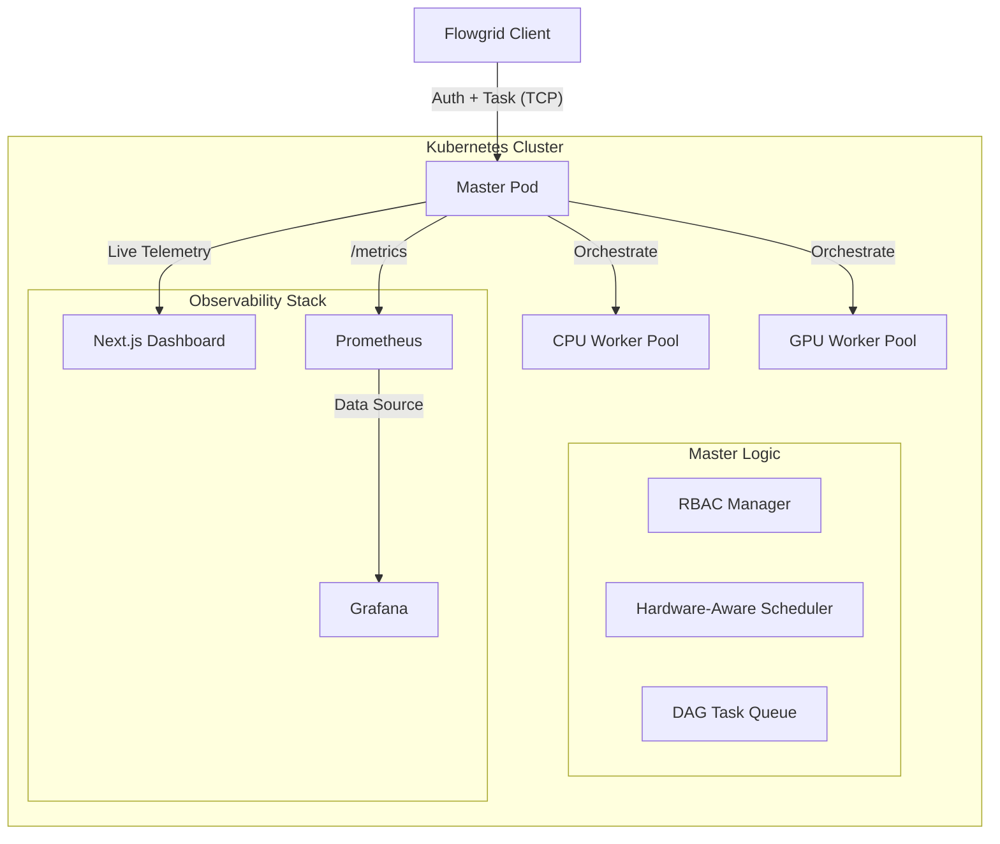

<p align="center">
  <h1 align="center">⚡ Flowgrid Enterprise</h1>
  <p align="center">
    <strong>A production-grade distributed container orchestration engine built for Kubernetes.</strong>
  </p>
  <p align="center">
    <a href="#-quickstart"></a>
    <a href="#-architecture"></a>
    
    
  </p>
</p>

---

Flowgrid Enterprise is a high-performance, fault-tolerant distributed computing framework engineered for reliability, observability, and scale. Originally designed as a lightweight Python task runner, it has evolved into a fully Kubernetes-native ecosystem equipped with advanced scheduling, security, and observability features.

## ✨ Enterprise Feature Set

| Feature | Description |
| :--- | :--- |
| **Containerized Execution** | Every workload runs inside an ephemeral Docker container for isolation and dependency safety. |
| **DAG Workflows** | Supports complex dependency chains. Tasks execute only when prerequisites complete. |
| **Zero-Trust Security (RBAC)** | Role-Based Access Control and secure API key injection via environment variables. |
| **Hardware-Aware Scheduling** | Intelligent routing to CPU vs. GPU nodes (`nvidia.com/gpu: 1`) using least-loaded strategies. |
| **Horizontal Autoscaling** | HPA dynamically scales the cluster from 2 to 10 workers based on 70% CPU thresholds. |
| **Dual Observability** | Custom Next.js Dark Mode Dashboard + Helm-deployed Prometheus/Grafana stack. |
| **CI/CD Automation** | GitHub Actions pipeline for automated `pytest` execution and Docker image builds. |

## 🏗️ Architecture



## 🚀 Quickstart (Local KIND Cluster)

To spin up the entire enterprise stack on a local laptop using KIND (Kubernetes in Docker):

### 1. Build and Load Images
Because local Kubernetes cannot pull local images by default, use the provided helper script:
```bash
./deploy/k8s/build_and_load.sh
```

### 2. Deploy the Engine
```bash
kubectl apply -f deploy/k8s/
```

### 3. Expose the Network
Port-forward the Master service so your local machine can communicate with the cluster:
```bash
kubectl port-forward svc/flowgrid-master-service 8080:8080 9999:9999
```

## 💻 Client Usage

```python
from client.flowgrid_client import FlowgridClient
import os

# Connect to the Master node via TCP
client = FlowgridClient("localhost", 9999)
client.connect()

# Authenticate with the cluster
client.authenticate(os.getenv("FLOWGRID_ADMIN_KEY", "flowgrid_admin_123"))

# Submit a containerized task
task_id = client.submit_docker_task(
    image="alpine", 
    command="echo 'Hello Kubernetes!'"
)

# Retrieve results (auto-polls until complete)
result = client.get_result(task_id)
print(f"Result: {result}")

client.disconnect()
```

## 📊 Observability Stack

### Flowgrid Dashboard
Access the premium real-time visualization dashboard:
```
http://localhost:8080 (or http://dashboard.flowgrid.local via Ingress)
```

### Prometheus & Grafana
Deployed via Helm Charts for deep infrastructure scraping:
*   **Grafana**: Run `kubectl port-forward svc/observability-grafana 3000:80`
*   **Username**: `admin`
*   **Password**: `flowgrid_admin`

## 🧪 Testing & CI/CD
The repository uses GitHub Actions for continuous integration.

```bash
# Run the complete test suite locally
export PYTHONPATH=$PYTHONPATH:.
pytest tests/ -v
```

## 🛡️ Fault Tolerance

- **Worker crash** → Master detects via heartbeat timeout → tasks re-queued automatically
- **Network partition** → Workers auto-reconnect with exponential backoff
- **Task timeout** → FaultToleranceManager re-queues unfinished tasks
- **Duplicate results** → Idempotency keys discard late/stale results
- **Malformed messages** → Binary framing rejects corrupt payloads at the protocol layer

---

<p align="center">
  <strong>Built with ❤️ as a systems engineering deep-dive into distributed computing.</strong>
</p>
