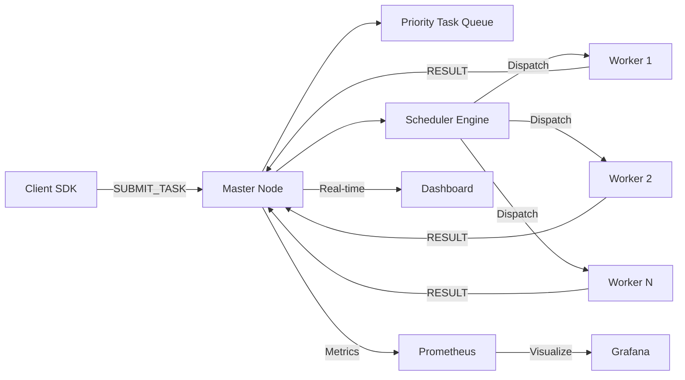

<p align="center">
  <h1 align="center">⚡ Flowgrid</h1>
  <p align="center">
    <strong>A production-grade distributed task processing engine built from scratch in Python.</strong>
  </p>
  <p align="center">
    <a href="#-quickstart"></a>
    <a href="#-benchmarking"></a>
    <a href="#-architecture"></a>
  </p>
</p>

---

Flowgrid is a high-performance, fault-tolerant distributed computing framework engineered for reliability, observability, and scale. Inspired by [Ray](https://www.ray.io/), it provides a seamless Python API to execute functions across a cluster of worker nodes — with built-in scheduling, heartbeat monitoring, chaos resilience, and a full observability stack.

## ✨ Key Engineering Highlights

| Feature | Description |
| :--- | :--- |
| **Custom TCP Framing** | Length-prefixed binary protocol (`[4-byte header] + [JSON payload]`) — eliminates stream fragmentation and partial-read bugs. |
| **Idempotent Task Execution** | Guaranteed task integrity via unique idempotency keys. Late results from timed-out workers are automatically discarded. |
| **Chaos-Hardened** | Built-in resilience against network partitions, worker crashes, malformed protocol attacks, and Byzantine failures. |
| **Intelligent Scheduling** | Least-loaded worker dispatch with real-time heartbeat-driven load tracking. |
| **Full Observability** | Production-grade Prometheus metrics + Grafana dashboards + live HTML command dashboard — all out of the box. |
| **Auto-Recovery** | Workers auto-reconnect on disconnect. Failed tasks are re-queued transparently. Stale workers are reaped. |

## 🏗️ Architecture

```
┌─────────────────────────────────────────────────────────────────┐
│                          FLOWGRID CLUSTER                       │
│                                                                 │
│  ┌──────────┐    SUBMIT_TASK     ┌──────────────────────────┐   │
│  │  Client   │ ───────────────▶  │       Master Node        │   │
│  │  (SDK)    │ ◀─────────────── │                          │   │
│  └──────────┘    ACK / RESULT    │  ┌────────┐ ┌────────┐  │   │
│                                  │  │Scheduler│ │ Fault  │  │   │
│                                  │  │  Engine │ │Toleranc│  │   │
│  ┌──────────┐                    │  └────┬───┘ └────┬───┘  │   │
│  │Prometheus │◀── Scrape ────── │       │          │      │   │
│  │  :8000    │                    │  ┌────▼──────────▼───┐  │   │
│  └────┬─────┘                    │  │   Task Queue       │  │   │
│       │                          │  └────────┬──────────┘  │   │
│  ┌────▼─────┐                    └───────────┼─────────────┘   │
│  │ Grafana   │                               │                  │
│  │  :3000    │                    ┌──────────▼──────────┐       │
│  └──────────┘                    │    Worker Pool       │       │
│                                  │ ┌────┐ ┌────┐ ┌────┐│       │
│  ┌──────────┐                    │ │ W1 │ │ W2 │ │ W3 ││       │
│  │Dashboard  │◀── HTTP ─────── │ └────┘ └────┘ └────┘│       │
│  │  :8080    │                    └─────────────────────┘       │
│  └──────────┘                                                   │
└─────────────────────────────────────────────────────────────────┘
```

### Data Flow



## 🧩 Project Structure

```
flowgrid/
├── client/                  # Python SDK for task submission & retrieval
│   └── ray_client.py        # RayClient — developer-facing API
│
├── master/                  # Central control plane
│   ├── master.py            # Master node lifecycle orchestrator
│   ├── metrics.py           # Prometheus metric definitions
│   ├── http_gateway.py      # Live dashboard HTTP bridge
│   ├── network/             # TCP server & connection handling
│   ├── queue/               # Thread-safe priority task queue
│   ├── scheduler/           # Least-loaded worker dispatch engine
│   ├── worker_manager/      # Worker registry & heartbeat tracking
│   ├── result_manager/      # Task result storage & retrieval
│   └── fault_tolerance/     # Timeout detection & task re-queuing
│
├── worker/                  # Distributed compute nodes
│   └── worker.py            # Worker node with executor & heartbeat
│
├── common/                  # Shared protocol layer
│   ├── models/              # Task, Message, MessageType definitions
│   ├── network/             # Binary-framed TCP connection handler
│   ├── serialization/       # Safe JSON encode/decode
│   └── utils/               # UUID generation, timestamps, logging
│
├── dashboard/               # Real-time glassmorphic web dashboard
│   └── index.html           # Live cluster monitoring UI
│
├── benchmarks/              # Industry-grade performance suite
│   └── industry_benchmark.py
│
├── tests/                   # Comprehensive test suite
│   ├── test_chaos.py        # Chaos engineering tests
│   ├── test_client.py       # Client SDK tests
│   ├── test_common.py       # Protocol & model tests
│   ├── test_fault_tolerance.py
│   ├── test_master.py
│   ├── test_networking.py
│   ├── test_queue.py
│   ├── test_scheduler.py
│   └── ...
│
├── monitoring/              # Prometheus scrape configuration
│   └── prometheus.yml
│
├── deploy/                  # systemd service files for auto-boot
│   ├── flowgrid-master.service
│   ├── flowgrid-worker@.service
│   └── install_service.sh
│
├── docker-compose.yml       # One-command full cluster deployment
├── Dockerfile               # Container image definition
├── start_cluster.sh         # Local cluster launcher
├── stop_cluster.sh          # Cluster shutdown script
└── requirements.txt         # Python dependencies
```

## 🚀 Quickstart

### Option A — Docker (Recommended)

Spin up a full cluster (1 Master, 3 Workers, Prometheus, Grafana) with one command:

```bash
docker-compose up -d
```

| Service | URL |
| :--- | :--- |
| **Live Dashboard** | [http://localhost:8080](http://localhost:8080) |
| **Prometheus** | [http://localhost:9090](http://localhost:9090) |
| **Grafana** | [http://localhost:3000](http://localhost:3000) |
| **Master TCP** | `localhost:9999` |

### Option B — Local (Bare Metal)

```bash
# 1. Install dependencies
pip install -r requirements.txt

# 2. Launch the entire cluster
bash start_cluster.sh

# 3. Stop the cluster
bash stop_cluster.sh
```

### Option C — System Service (Auto-Boot)

```bash
# Install as a systemd service — cluster starts on every boot
sudo bash deploy/install_service.sh
```

## 💻 Client Usage

```python
from client.ray_client import RayClient

# Connect to the cluster
client = RayClient("localhost", 9999)
client.connect()

# Submit tasks
task_id = client.submit_task("monte_carlo_pi", 100_000)

# Retrieve results (auto-polls until complete)
result = client.get_result(task_id)
print(f"π ≈ {result}")

client.disconnect()
```

### Built-in Compute Functions

| Function | Category | Description |
| :--- | :--- | :--- |
| `monte_carlo_pi(samples)` | Financial Risk | Monte Carlo π estimation |
| `matrix_multiply(n)` | ML / Linear Algebra | NxN matrix multiplication |
| `hash_crunch(data, rounds)` | Security / Crypto | SHA-256 hash chain |
| `etl_transform(records, mult)` | Data Pipeline | Filter → Transform → Aggregate |
| `sort_benchmark(n)` | Data Warehousing | Large list sort |
| `hyperparameter_search(lr, reg)` | Machine Learning | Grid search evaluation |
| `io_simulation(kb, ms)` | Network / Disk | Simulated I/O workload |
| `add(x, y)` | Utility | Addition |
| `multiply(x, y)` | Utility | Multiplication |

## 📊 Benchmarking

Run the full industry-grade benchmark suite:

```bash
# Run all 5 benchmarks
python3 -m benchmarks.industry_benchmark

# Run a specific benchmark
python3 -m benchmarks.industry_benchmark --bench monte_carlo
python3 -m benchmarks.industry_benchmark --bench hyperparam
python3 -m benchmarks.industry_benchmark --bench etl
python3 -m benchmarks.industry_benchmark --bench hash
python3 -m benchmarks.industry_benchmark --bench chaos
```

### Benchmark Suite

| # | Benchmark | Workload Type | Simulates |
| :--- | :--- | :--- | :--- |
| 1 | Monte Carlo Risk | CPU-bound | Financial risk modeling |
| 2 | Hyperparameter Grid | CPU-bound | ML model tuning |
| 3 | ETL Pipeline | Mixed | Data warehouse transforms |
| 4 | Hash Crunch | CPU-bound | Cryptographic / security ops |
| 5 | Chaos Load | Mixed I/O+CPU | Production traffic patterns |

## 📈 Observability

Flowgrid exports the following Prometheus metrics (prefix: `flowgrid_`):

| Metric | Type | Description |
| :--- | :--- | :--- |
| `flowgrid_queue_size` | Gauge | Current pending task count |
| `flowgrid_workers_active` | Gauge | Live worker count |
| `flowgrid_tasks_submitted_total` | Counter | Total tasks received |
| `flowgrid_tasks_processed_total` | Counter | Tasks completed / failed |
| `flowgrid_task_latency_seconds` | Histogram | End-to-end task latency |

## 🧪 Testing

```bash
# Run the complete test suite
python3 -m unittest discover tests

# Run specific test modules
python3 -m unittest tests.test_chaos
python3 -m unittest tests.test_scheduler
python3 -m unittest tests.test_fault_tolerance
```

## ⚙️ Configuration

| Flag | Default | Description |
| :--- | :--- | :--- |
| `--host` | `0.0.0.0` | Master bind address |
| `--port` | `9999` | Master TCP port |
| `--metrics-port` | `8000` | Prometheus scrape port |
| `--dashboard-port` | `8080` | Live dashboard HTTP port |
| `--stale-timeout` | `10.0s` | Worker offline threshold |
| `--task-timeout` | `60.0s` | Task retry threshold |

## 🛡️ Fault Tolerance

- **Worker crash** → Master detects via heartbeat timeout → tasks re-queued automatically
- **Network partition** → Workers auto-reconnect with exponential backoff
- **Task timeout** → FaultToleranceManager re-queues unfinished tasks
- **Duplicate results** → Idempotency keys discard late/stale results
- **Malformed messages** → Binary framing rejects corrupt payloads at the protocol layer

## 📦 Requirements

- Python 3.10+
- `prometheus_client` (for metrics export)
- Docker & Docker Compose (optional, for containerized deployment)

---

<p align="center">
  <strong>Built with ❤️ as a systems engineering deep-dive into distributed computing.</strong>
</p>
